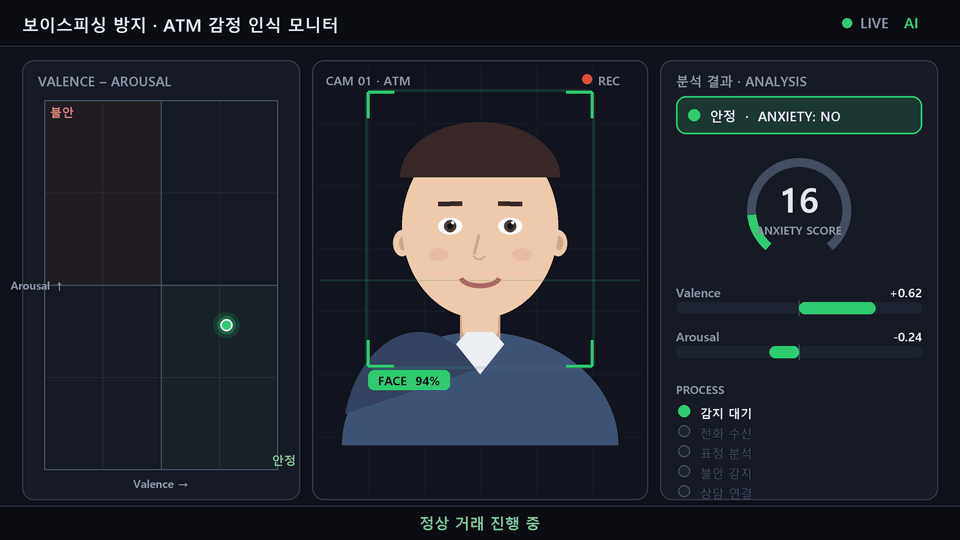
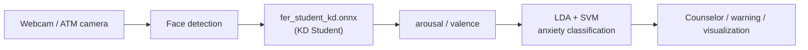

<div align="center">

# ATM Emotion Recognition for Voice-Phishing Prevention

**Team Triforce** · Sangmyung University · 2024 Graduation Project

[한국어](README.md) · **English**

[](https://www.python.org/)
[](https://opencv.org/)
[](https://onnxruntime.ai/)
[](https://scikit-learn.org/)


[Presentation](docs/demo/triforce_graduation_presentation.mp4) · [Portfolio](docs/PORTFOLIO.md) · [Web Portfolio](docs/web/index.html)

</div>

---

## At a Glance

|  |  |
|:--|:--|
| 🎯 **What** | Real-time facial-expression analysis at the ATM to detect **anxiety** — an early sign of a voice-phishing victim |
| ⚙️ **How** | Lightweight FER (Knowledge Distillation) → arousal/valence → **LDA + SVM anxiety classifier** |
| 📊 **Results** | **86%** accuracy · **0.96** anxiety recall · **56× less** compute than the teacher |
| 🖥️ **Deliverable** | Real-time webcam demo [`src/cap.py`](src/cap.py) · presented at the 2024 Graduation Portfolio Festival |
| 👥 **Team** | Triforce — Kim Seong-hyeon · Byeon Seong-ho · Ahn Seong-chan · Lim Jae-young · Jin Seok-ho |

> **Motivation** — Static ATM warning messages are largely ineffective. We read **anxiety directly from the face** and intervene actively.
> `camera → emotion recognition → anxiety classification → counselor alert`

---

## Demo

<div align="center">



**Normal transaction → phishing call received → anxiety detected from expression → counselor alert**

</div>

- Same on-screen UI as the real [`src/cap.py`](src/cap.py) demo (face box · `Anxiety` label/Score · valence/arousal bars · 2D valence–arousal chart)
- Re-created with an **illustrated avatar** instead of real faces for privacy (generator: [`tools/make_demo_gif.py`](tools/make_demo_gif.py))
- The chart dot moves from the **calm → anxiety** quadrant, the box turns **green → red**, and the Score rises

| Resource | Description |
|:---|:---|
| [Presentation video](docs/demo/triforce_graduation_presentation.mp4) | Full team presentation (~8 min) |
| `python src/cap.py` | Real-time webcam anxiety-detection demo |

---

## Problem

| | |
|:--|:--|
| **Problem** | Exposure to financial crime (voice phishing) during ATM use · passive warning messages have limited effect |
| **Solution** | Recognize facial expression / emotional state → on anxiety signs, connect a counselor and show guidance |
| **Flow** | `ATM user → AI camera (emotion recognition) → anxiety detected → counselor / warning alert` |

---

## System Architecture



**Processing steps**

1. Capture webcam frames
2. KD-based face detection, landmarks, and emotion dimensions (arousal/valence)
3. LDA + SVM anxiety prediction and Score conversion
4. Overlay face info · anxiety level · arousal/valence · Score on screen

**Multithreading**

| Thread | Role |
|:---|:---|
| Webcam Thread | Frame capture, rendering |
| Batch Thread | Face detection, ONNX inference, anxiety classification |

---

## Data

| Item | Detail |
|:---|:---|
| Dataset | **AI-Hub** [Korean Emotion Recognition multimodal video](https://www.aihub.or.kr/) (~500K samples) |
| Rationale | Korean faces compensate for EmoNet's foreigner-centric training |
| Labels (7) | Joy · Embarrassment · Anger · **Anxiety** · Hurt · Sadness · Neutral |
| Preprocessing | Extract arousal/valence with EmoNet → scatter plot by similar/dissimilar criteria |
| Distribution | ~70K images per category, balanced |

---

## Models

### Stage 1 · Lightweight FER (Knowledge Distillation)

> Follows [Lee et al., *Appl. Sci.* 2023](https://doi.org/10.3390/app13116409). Three models — RetinaFace (detection), FAN (landmarks), EmoNet (emotion) — unified and compressed via KD.

| Role | Model | Function |
|:---|:---|:---|
| Teacher | EmoNet | 8-class emotion + valence/arousal regression |
| Student | MobileNetV2 | Lightweight inference (**0.3 GMAC**) |
| Training | KD + Teacher Bound | Joint classification + regression |

- **~56× less** compute, accuracy drop within **1.64%p**
- **Real-time inference on CPU**

### Stage 2 · Anxiety Classification (LDA + SVM)

```
arousal, valence → StandardScaler → LDA → SVM(RBF) → Anxiety Yes/No + Score
```

**Emotion mapping (7 → 2)**

| Calm | Anxious |
|:---:|:---:|
| Joy, Neutral | Embarrassment, Anger, Anxiety, Hurt, Sadness |

**Tunable SVM sensitivity**

| Mode | Config | Use case |
|:---|:---|:---|
| High-sensitivity | `C=3`, `class_weight={0:1, 1:2}` | Urgent response, dispatch staff |
| Low-sensitivity | `C=1`, `class_weight={0:2, 1:1}` | General monitoring, UX-first |

---

## Performance

Anxiety-detection model (SVM · `C=3` · `class_weight={0:1, 1:2}`)

| Metric | Non-Anxiety | Anxiety | Overall |
|:---|:---:|:---:|:---:|
| Precision | 0.88 | 0.85 | 0.86 |
| Recall | 0.67 | **0.96** | 0.86 |
| F1-Score | 0.76 | 0.90 | 0.86 |
| **Accuracy** | | | **86%** |

> **0.96 recall** on the anxiety class — strong at not missing real anxiety.

---

## Getting Started

```bash
git clone https://github.com/sukoji/emonet-anxiety-detection.git
cd emonet-anxiety-detection

python -m venv .venv
.venv\Scripts\activate
pip install -r requirements.txt

# place models/labels under assets/ (see assets/README.md)
python src/cap.py
```

**On-screen overlay:** `Anxiety: Yes/No` · Score · valence/arousal values · 2D valence–arousal chart

---

## Project Structure

```
emonet-anxiety-detection/
├── README.md / README.en.md
├── requirements.txt
├── src/
│   └── cap.py                              # final real-time demo
├── tools/
│   └── make_demo_gif.py                    # demo scenario GIF generator
├── assets/
│   ├── models/fer_student_kd.onnx          # KD student FER model
│   ├── data/anxiety_classifier_labels.csv  # anxiety classifier labels
│   └── ui/valence_arousal_chart_bg.png     # chart background (optional)
└── docs/
    ├── PORTFOLIO.md
    ├── demo/demo_scenario.gif              # scenario animation
    ├── demo/triforce_graduation_presentation.mp4
    └── web/index.html
```

---

## Impact & Future Work

| Impact | Future work |
|:---|:---|
| **Protection just before the crime** via warning + counselor connection | Improve accuracy with more diverse ethnicity/emotion data |
| **Expanded UI/counseling** for elderly and disabled users | Add **voice recognition** (intonation, keywords) for higher confidence |
| **Differentiated safety/trust** when integrated into in-bank kiosks | **Auto-tuned sensitivity** from install environment and feedback |
| | Real-time data-sharing framework with financial/public institutions |

---

## References

```bibtex
@article{lee2023fast,
  author  = {Lee, Kunyoung and Kim, Seunghyun and Lee, Eui Chul},
  title   = {Fast and Accurate Facial Expression Image Classification
             and Regression Method Based on Knowledge Distillation},
  journal = {Applied Sciences},
  volume  = {13}, number = {11}, pages = {6409},
  year    = {2023}, doi = {10.3390/app13116409}
}

@article{toisoul2021estimation,
  author  = {Toisoul, Antoine and others},
  title   = {Estimation of continuous valence and arousal levels
             from faces in naturalistic conditions},
  journal = {Nature Machine Intelligence},
  year    = {2021}, doi = {10.1038/s42256-020-00280-0}
}
```

---

<div align="center">

**Team Triforce** · Sangmyung University · 2024 Graduation Project

Kim Seong-hyeon · Byeon Seong-ho · Ahn Seong-chan · Lim Jae-young · Jin Seok-ho

</div>
