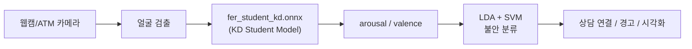

<div align="center">

# 보이스피싱 피해자 방지를 위한 ATM 감성인식 시스템

**팀 트라이포스 (Tripos)** · 상명대학교 · 2024 졸업 프로젝트

[](https://www.python.org/)
[](https://opencv.org/)
[](https://onnxruntime.ai/)
[](https://scikit-learn.org/)

[발표 영상](docs/demo/tripos_graduation_presentation.mp4) · [상세 포트폴리오](docs/PORTFOLIO.md) · [웹 포트폴리오](docs/web/index.html)

</div>

---

## 팀 소개

**팀 트라이포스**는 상명대학교에서 2024년 졸업 포트폴리오 페스티벌(2024.11.04–11.05)에 제출한 졸업 팀 프로젝트입니다.

**팀원:** 김성현 · 변성호 · 안성찬 · 임재영 · 진석호

---

## 프로젝트 개요

ATM 이용 중 발생할 수 있는 보이스피싱 피해를 조기에 감지하기 위해, 카메라로 사용자의 얼굴 표정을 분석하고 감정 상태를 실시간으로 추정하는 시스템을 개발했습니다.

기존 ATM의 경고 문구만으로는 실질적인 예방 효과가 제한적이라는 문제의식에서 출발했습니다. 본 프로젝트는 얼굴 표정 인식(FER)과 머신러닝을 결합해 **불안 상태를 탐지**하고, 상담원 연결·대응 메시지 출력 등 후속 조치로 이어지는 흐름을 목표로 합니다.

핵심 기술은 [Lee et al. (2023)](https://doi.org/10.3390/app13116409)의 Knowledge Distillation + Teacher Bound 기반 경량 FER 모델과, arousal/valence 기반 **LDA + SVM 불안 분류기**입니다. 최종 데모 구현은 `src/cap.py`입니다.

---

## 문제 정의와 목표

**문제 상황**
- ATM 사용 중 보이스피싱 등 금융 범죄에 노출될 위험
- 기존 경고 메시지의 실효성 한계

**해결 방향**
- 카메라로 피해자의 얼굴 표정·감정 상태를 인식
- 불안 징후 감지 시 상담원 연결, 대응 안내 메시지 등 조치 수행

**시스템 흐름**

```
ATM 사용자 → AI 카메라(감정 인식) → 불안 감지 → 상담원 연결 / 경고 알림
```

---

## 시스템 구조

### 전체 파이프라인



### 처리 단계 (발표 자료 System Process 기준)

1. 웹캠 프레임 수집
2. Knowledge Distillation 기반 얼굴 검출·랜드마크·감정 차원 인식
3. LDA + SVM으로 불안 예측 및 Score 변환
4. 화면에 얼굴 정보, 불안 수준, arousal/valence, Score 표시

### 멀티스레드 구조

| 스레드 | 역할 |
|:---|:---|
| Webcam Thread | 프레임 수집, 렌더링 |
| Batch Thread | 얼굴 검출, ONNX 추론, 불안 분류 |

---

## 데이터

**AI-Hub** [한국인 감정인식을 위한 복합 영상](https://www.aihub.or.kr/) 데이터셋을 사용했습니다. 약 50만 건 규모이며, 외국인 중심으로 학습된 EmoNet의 한계를 보완하기 위해 한국인 얼굴 데이터를 활용했습니다.

7가지 감정 레이블: 기쁨 · 당황 · 분노 · **불안** · 상처 · 슬픔 · 중립

데이터 전처리 과정에서는 EmoNet으로 arousal/valence를 추출하고, AI-Hub 문서의 유사/비유사 감정 기준에 따라 이진 분류용 scatter plot을 구성했습니다. 카테고리별 데이터 수는 약 7만 장 수준으로 균등 분포를 확인했습니다.

---

## 모델

### 1단계: 경량 FER (Knowledge Distillation)

[Lee et al., *Appl. Sci.* 2023](https://doi.org/10.3390/app13116409) 방법을 따릅니다.

| 구성 | 모델 | 역할 |
|:---|:---|:---|
| Teacher | EmoNet | 8종 감정 분류 + valence/arousal 회귀 |
| Student | MobileNetV2 | 경량 추론 (0.3 GMAC) |
| 학습 | KD + Teacher Bound | 분류·회귀 동시 학습 |

Teacher 대비 연산량 약 56배 감소, 정확도 하락 1.64%p 이내. CPU 환경 실시간 추론이 가능합니다.

발표에서는 RetinaFace(얼굴 검출), FAN(랜드마크), EmoNet(감정 분석) 3모델을 Knowledge Distillation으로 통합·경량화한 과정을 설명했습니다.

### 2단계: 불안 분류 (LDA + SVM)

```
arousal, valence → StandardScaler → LDA → SVM(RBF) → Anxiety Yes/No + Score
```

**감정 매핑 (7종 → 2종)**

| 감정 | 분류 |
|:---|:---:|
| 기쁨, 중립 | 안정 |
| 당황, 분노, 불안, 상처, 슬픔 | 불안 |

**SVM 하이퍼파라미터 유연성**

| 모드 | 설정 | 용도 |
|:---|:---|:---|
| 고감도 | `C=3`, `class_weight={0:1, 1:2}` | 긴급 대응, 직원 파견 |
| 저감도 | `C=1`, `class_weight={0:2, 1:1}` | 일반 모니터링, UX 중심 |

---

## 성능

불안 탐지 모델(SVM, `C=3`, `class_weight={0:1, 1:2}`) 기준:

| 지표 | Non-Anxiety | Anxiety | 전체 |
|:---|:---:|:---:|:---:|
| Precision | 0.88 | 0.85 | 0.86 |
| Recall | 0.67 | **0.96** | 0.86 |
| F1-Score | 0.76 | 0.90 | 0.86 |
| **Accuracy** | | | **86%** |

불안 클래스 Recall 0.96으로, 실제 불안 상태를 놓치지 않는 데 강점이 있습니다.

---

## 데모

| 자료 | 설명 |
|:---|:---|
| [졸업페스티벌 발표 영상](docs/demo/tripos_graduation_presentation.mp4) | 팀 트라이포스 전체 발표 (약 8분) |
| `python src/cap.py` | 실시간 웹캠 불안 탐지 데모 |

데모 화면에서는 `Anxiety: Yes/No`, Score, Valence/Arousal 수치, 2D 감정 좌표 그래프가 함께 표시됩니다.

---

## 프로젝트 구조

```
emonet-anxiety-detection/
├── README.md
├── requirements.txt
├── src/
│   └── cap.py                              # 최종 실시간 데모
├── assets/
│   ├── models/fer_student_kd.onnx          # KD student FER 모델
│   ├── data/anxiety_classifier_labels.csv  # 불안 분류기 학습 라벨
│   └── ui/valence_arousal_chart_bg.png     # 차트 배경 (선택)
└── docs/
    ├── PORTFOLIO.md
    ├── demo/tripos_graduation_presentation.mp4
    └── web/index.html
```

---

## 실행 방법

```bash
git clone https://github.com/sukoji/emonet-anxiety-detection.git
cd emonet-anxiety-detection

python -m venv .venv
.venv\Scripts\activate
pip install -r requirements.txt

# assets/ 에 모델·라벨 배치 (assets/README.md 참고)
python src/cap.py
```

---

## 기대 효과

- **고객 안전 강화:** 보이스피싱 의심 시 경고·상담원 연결로 범죄 직전 단계에서 보호
- **기능 확장:** 고령자·장애인 등 키오스크 이용이 어려운 사용자를 위한 UI·상담 기능 확장 가능
- **은행 키오스크 신뢰성:** 인-bank 키오스크에 통합해 안전성·편의성 차별화

---

## 한계 및 향후 과제

- 다양한 인종·감정 데이터 추가로 인식 정확도 개선
- 음성 인식 결합(억양·키워드)으로 피싱 탐지 신뢰도 향상
- ATM 설치 환경별·사용자 피드백 기반 감도 자동 조절
- 금융·공공기관 연계 실시간 데이터 공유 체계 구축

---

## 참고 문헌

```bibtex
@article{lee2023fast,
  author  = {Lee, Kunyoung and Kim, Seunghyun and Lee, Eui Chul},
  title   = {Fast and Accurate Facial Expression Image Classification
             and Regression Method Based on Knowledge Distillation},
  journal = {Applied Sciences},
  volume  = {13}, number = {11}, pages = {6409},
  year    = {2023}, doi = {10.3390/app13116409}
}
```

```bibtex
@article{toisoul2021estimation,
  author  = {Toisoul, Antoine and others},
  title   = {Estimation of continuous valence and arousal levels
             from faces in naturalistic conditions},
  journal = {Nature Machine Intelligence},
  year    = {2021}, doi = {10.1038/s42256-020-00280-0}
}
```

---

<div align="center">

**팀 트라이포스** · 상명대학교 · 2024 졸업 프로젝트

김성현 · 변성호 · 안성찬 · 임재영 · 진석호

</div>
