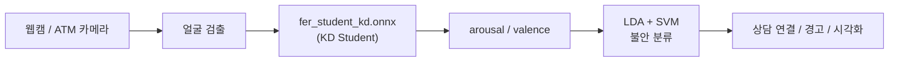

<div align="center">

# 보이스피싱 피해자 방지를 위한 ATM 감성인식 시스템

**팀 트라이포스 (Tripos)** · 상명대학교 · 2024 졸업 프로젝트

**한국어** · [English](README.en.md)

[](https://www.python.org/)
[](https://opencv.org/)
[](https://onnxruntime.ai/)
[](https://scikit-learn.org/)


[발표 영상](docs/demo/tripos_graduation_presentation.mp4) · [상세 포트폴리오](docs/PORTFOLIO.md) · [웹 포트폴리오](docs/web/index.html)

</div>

---

## 한눈에 보기

|  |  |
|:--|:--|
| 🎯 **무엇을** | ATM 카메라로 이용자 표정을 실시간 분석해 **불안(보이스피싱 피해) 징후**를 탐지 |
| ⚙️ **어떻게** | 경량 FER(Knowledge Distillation) → arousal/valence → **LDA + SVM 불안 분류** |
| 📊 **성과** | 정확도 **86%** · 불안 Recall **0.96** · Teacher 대비 연산량 **56× 감소** |
| 🖥️ **결과물** | 실시간 웹캠 데모 [`src/cap.py`](src/cap.py) · 2024 졸업 포트폴리오 페스티벌 발표 |
| 👥 **팀** | 트라이포스 — 김성현 · 변성호 · 안성찬 · 임재영 · 진석호 |

> **문제의식** — ATM의 정적인 경고 문구는 실효성이 낮다. 표정에서 **불안**을 직접 읽어 능동적으로 개입한다.
> `카메라 → 감정 인식 → 불안 분류 → 상담원 연결/경고`

---

## 데모

<div align="center">


**정상 거래 → 보이스피싱 전화 수신 → 표정에서 불안 감지 → 상담원 연결**

</div>

- 실제 [`src/cap.py`](src/cap.py) 데모와 **동일한 UI**(얼굴 검출 박스 · `Anxiety` 라벨/Score · Valence/Arousal 바 · 2D 감정 좌표 차트)
- 개인정보 보호를 위해 실제 얼굴 대신 **일러스트 아바타**로 재현 (생성 스크립트 [`tools/make_demo_gif.py`](tools/make_demo_gif.py))
- 감정 좌표 점이 **안정 → 불안** 사분면으로 이동, 박스 색이 **초록 → 빨강**, Score 상승

| 자료 | 설명 |
|:---|:---|
| [발표 영상](docs/demo/tripos_graduation_presentation.mp4) | 팀 트라이포스 전체 발표 (약 8분) |
| `python src/cap.py` | 실시간 웹캠 불안 탐지 데모 |

---

## 문제 정의

| | |
|:--|:--|
| **문제** | ATM 사용 중 보이스피싱 등 금융 범죄 노출 · 기존 경고 메시지의 실효성 한계 |
| **해결** | 카메라로 표정·감정 상태 인식 → 불안 징후 감지 시 상담원 연결·안내 메시지 |
| **흐름** | `ATM 사용자 → AI 카메라(감정 인식) → 불안 감지 → 상담원 연결 / 경고 알림` |

---

## 시스템 구조



**처리 단계**

1. 웹캠 프레임 수집
2. KD 기반 얼굴 검출·랜드마크·감정 차원(arousal/valence) 인식
3. LDA + SVM 불안 예측 및 Score 변환
4. 얼굴 정보 · 불안 수준 · arousal/valence · Score 화면 표시

**멀티스레드 구조**

| 스레드 | 역할 |
|:---|:---|
| Webcam Thread | 프레임 수집, 렌더링 |
| Batch Thread | 얼굴 검출, ONNX 추론, 불안 분류 |

---

## 데이터

| 항목 | 내용 |
|:---|:---|
| 데이터셋 | **AI-Hub** [한국인 감정인식을 위한 복합 영상](https://www.aihub.or.kr/) (~50만 건) |
| 사용 이유 | 외국인 중심으로 학습된 EmoNet의 한계를 한국인 얼굴로 보완 |
| 감정 라벨 (7종) | 기쁨 · 당황 · 분노 · **불안** · 상처 · 슬픔 · 중립 |
| 전처리 | EmoNet으로 arousal/valence 추출 → 유사/비유사 기준 scatter plot 구성 |
| 분포 | 카테고리별 약 7만 장, 균등 분포 확인 |

---

## 모델

### 1단계 · 경량 FER (Knowledge Distillation)

> [Lee et al., *Appl. Sci.* 2023](https://doi.org/10.3390/app13116409) 방법. RetinaFace(검출) · FAN(랜드마크) · EmoNet(감정) 3모델을 KD로 통합·경량화.

| 구성 | 모델 | 역할 |
|:---|:---|:---|
| Teacher | EmoNet | 8종 감정 분류 + valence/arousal 회귀 |
| Student | MobileNetV2 | 경량 추론 (**0.3 GMAC**) |
| 학습 | KD + Teacher Bound | 분류·회귀 동시 학습 |

- 연산량 **약 56× 감소**, 정확도 하락 **1.64%p 이내**
- **CPU 환경 실시간 추론** 가능

### 2단계 · 불안 분류 (LDA + SVM)

```
arousal, valence → StandardScaler → LDA → SVM(RBF) → Anxiety Yes/No + Score
```

**감정 매핑 (7종 → 2종)**

| 안정 | 불안 |
|:---:|:---:|
| 기쁨, 중립 | 당황, 분노, 불안, 상처, 슬픔 |

**SVM 감도 조절**

| 모드 | 설정 | 용도 |
|:---|:---|:---|
| 고감도 | `C=3`, `class_weight={0:1, 1:2}` | 긴급 대응, 직원 파견 |
| 저감도 | `C=1`, `class_weight={0:2, 1:1}` | 일반 모니터링, UX 중심 |

---

## 성능

불안 탐지 모델 (SVM · `C=3` · `class_weight={0:1, 1:2}`)

| 지표 | Non-Anxiety | Anxiety | 전체 |
|:---|:---:|:---:|:---:|
| Precision | 0.88 | 0.85 | 0.86 |
| Recall | 0.67 | **0.96** | 0.86 |
| F1-Score | 0.76 | 0.90 | 0.86 |
| **Accuracy** | | | **86%** |

> 불안 클래스 **Recall 0.96** — 실제 불안 상태를 놓치지 않는 데 강점.

---

## 실행 방법

```bash
git clone https://github.com/sukoji/emonet-anxiety-detection.git
cd emonet-anxiety-detection

python -m venv .venv
.venv\Scripts\activate
pip install -r requirements.txt

# assets/ 에 모델·라벨 배치 (assets/README.md 참고)
python src/cap.py
```

**데모 화면 표시:** `Anxiety: Yes/No` · Score · Valence/Arousal 수치 · 2D 감정 좌표 그래프

---

## 프로젝트 구조

```
emonet-anxiety-detection/
├── README.md / README.en.md
├── requirements.txt
├── src/
│   └── cap.py                              # 최종 실시간 데모
├── tools/
│   └── make_demo_gif.py                    # 데모 시나리오 GIF 생성 스크립트
├── assets/
│   ├── models/fer_student_kd.onnx          # KD student FER 모델
│   ├── data/anxiety_classifier_labels.csv  # 불안 분류기 학습 라벨
│   └── ui/valence_arousal_chart_bg.png     # 차트 배경 (선택)
└── docs/
    ├── PORTFOLIO.md
    ├── demo/demo_scenario.gif              # 동작 시나리오 애니메이션
    ├── demo/tripos_graduation_presentation.mp4
    └── web/index.html
```

---

## 기대 효과 & 향후 과제

| 기대 효과 | 향후 과제 |
|:---|:---|
| 보이스피싱 의심 시 경고·상담원 연결로 **범죄 직전 보호** | 다양한 인종·감정 데이터로 인식 정확도 개선 |
| 고령자·장애인 등 취약 사용자 대상 **UI·상담 확장** | **음성 인식 결합**(억양·키워드)으로 신뢰도 향상 |
| 인-뱅크 키오스크 통합으로 **안전성·신뢰성 차별화** | 설치 환경·피드백 기반 **감도 자동 조절** |
| | 금융·공공기관 연계 실시간 데이터 공유 체계 |

---

## 참고 문헌

```bibtex
@article{lee2023fast,
  author  = {Lee, Kunyoung and Kim, Seunghyun and Lee, Eui Chul},
  title   = {Fast and Accurate Facial Expression Image Classification
             and Regression Method Based on Knowledge Distillation},
  journal = {Applied Sciences},
  volume  = {13}, number = {11}, pages = {6409},
  year    = {2023}, doi = {10.3390/app13116409}
}

@article{toisoul2021estimation,
  author  = {Toisoul, Antoine and others},
  title   = {Estimation of continuous valence and arousal levels
             from faces in naturalistic conditions},
  journal = {Nature Machine Intelligence},
  year    = {2021}, doi = {10.1038/s42256-020-00280-0}
}
```

---

<div align="center">

**팀 트라이포스** · 상명대학교 · 2024 졸업 프로젝트

김성현 · 변성호 · 안성찬 · 임재영 · 진석호

</div>
