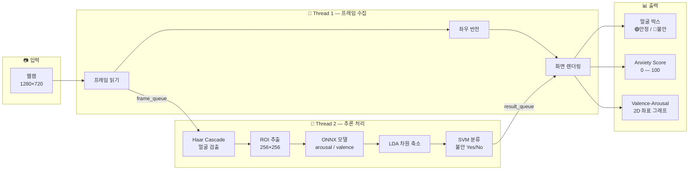

<div align="center">

# 🎓 Emotion-Based Anxiety Detection

### 실시간 얼굴 표정 분석 기반 불안 상태 탐지 시스템

**졸업 프로젝트 (Graduation Project)** · 2024

<br>

[](https://www.python.org/)
[](https://opencv.org/)
[](https://onnxruntime.ai/)
[](https://scikit-learn.org/)
[](https://pytorch.org/)

<br>

웹캠 영상에서 얼굴을 검출하고, **arousal / valence** 연속값을 추정한 뒤  
**LDA + SVM** 분류기로 **불안(Anxiety) 여부**를 실시간 판별하는 감정 AI 시스템

<br>

[📄 상세 포트폴리오](docs/PORTFOLIO.md) · [📝 이력서 요약](docs/RESUME_SUMMARY.md) · [🌐 웹 포트폴리오](docs/web/index.html)

</div>

---

<br>

## 📌 프로젝트 한눈에 보기

| 항목 | 내용 |
|:---|:---|
| **프로젝트 유형** | 졸업 프로젝트 (캡스톤) |
| **주제** | 실시간 얼굴 감정 분석 기반 불안 상태 탐지 |
| **개발 기간** | 2024.03 — 2024.10 (최종본 기준) |
| **입력** | 웹캠 실시간 영상 (1280×720) |
| **출력** | 불안 Yes/No, Anxiety Score (0–100), Valence/Arousal 시각화 |
| **최종 구현** | `src/cap.py` — 멀티스레드 실시간 데모 |
| **기반 연구** | [EmoNet (Nature Machine Intelligence, 2021)](https://www.nature.com/articles/s42256-020-00280-0) |

<br>

## 💡 프로젝트 배경

### 문제 인식

기존 감정 인식 시스템은 대부분 **이산적 감정 라벨**(행복, 슬픔, 분노 등)만 출력합니다.  
하지만 실제 심리 상태 판단에는 **감정의 강도와 방향** — 즉 arousal(각성도)과 valence(긍·부정성) — 이 더 유용한 지표가 됩니다.

> *"사람이 불안해 보이는지"를 판단하려면, 단순 라벨 분류가 아니라 연속적인 감정 공간에서의 위치를 이해해야 한다.*

### 프로젝트 목표

| # | 목표 | 달성 |
|:---:|:---|:---:|
| 1 | 웹캠 입력만으로 **비침습적** 실시간 감정 분석 | ✅ |
| 2 | arousal/valence 연속값을 **불안 이진 분류**로 변환 | ✅ |
| 3 | 사용자가 즉시 이해할 수 있는 **시각적 피드백** 제공 | ✅ |
| 4 | CPU 환경에서도 동작하는 **경량 추론** (ONNX) | ✅ |

<br>

## 🏗️ 시스템 아키텍처



### 데이터 흐름 상세

```
웹캠 프레임
    │
    ├─ [Thread 1] frame_queue (max 16) ──────────────────────────────┐
    │                                                                 │
    └─ [Thread 2]                                                     │
         │                                                            │
         ├─ Grayscale 변환                                           │
         ├─ Haar Cascade 얼굴 검출                                    │
         ├─ ROI Crop → Resize (256×256) → Normalize [0, 1]          │
         ├─ ONNX Inference ──→ arousal, valence                     │
         ├─ StandardScaler → LDA → SVM ──→ anxiety (0/1), score       │
         │                                                            │
         └─ result_queue (max 8) ────────────────────────────────────┘
                                    │
                                    ▼
                          실시간 오버레이 렌더링
                          (박스 색상 + 텍스트 + 그래프)
```

<br>

## 🔬 핵심 기술 상세

### 1. 감정 추정 — ONNX 기반 경량 추론

EmoNet 계열 모델을 **ONNX 포맷**으로 변환하여 CPU 환경에서도 실시간 추론이 가능하도록 최적화했습니다.

| 항목 | 내용 |
|:---|:---|
| 모델 | `FER_student (1).onnx` (학습된 FER 모델) |
| 입력 | 얼굴 ROI 이미지 256×256×3 (RGB, normalized) |
| 출력 | arousal (각성도), valence (긍·부정성) |
| 런타임 | ONNX Runtime (CPU) |

### 2. 불안 분류 — LDA + SVM 2단계 파이프라인

arousal/valence 2차원 특징을 불안 여부로 분류하는 **통계 기반 2단계 모델**을 설계했습니다.

```
[arousal, valence]
       │
       ▼
 SimpleImputer (결측치 평균 대체)
       │
       ▼
 StandardScaler (표준화)
       │
       ▼
 LDA (선형 판별 분석 — 차원 축소)
       │
       ├──→ Score 변환 (0 ~ 100 스케일)
       │
       ▼
 SVM (RBF 커널 — 이진 분류)
       │
       ▼
 Anxiety: Yes (1) / No (0)
```

**레이블 설계**

| 원본 감정 (7종) | 매핑 | 분류 |
|:---|:---:|:---:|
| 기쁨 (0), 중립 (5) | → 0 | **안정** |
| 당황, 분노, 불안, 상처, 슬픔 | → 1 | **불안** |

> 7가지 한국어 감정 레이블을 **안정/불안 이진 분류**로 재구성하여, 다차원 감정 공간에서 심리 상태를 단순하면서도 의미 있게 표현했습니다.

### 3. 실시간 처리 — 멀티스레드 + 큐 구조

| 구성 요소 | 역할 | 크기 |
|:---|:---|:---:|
| `frame_queue` | 웹캠 → 추론 스레드 프레임 전달 | max 16 |
| `result_queue` | 추론 → 렌더링 스레드 결과 전달 | max 8 |
| Webcam Thread | 프레임 수집, 좌우 반전, 화면 표시 | daemon |
| Batch Thread | 얼굴 검출, ONNX 추론, 분류 | daemon |

큐가 가득 차면 **오래된 프레임을 폐기**하여 항상 최신 상태를 유지합니다.

### 4. 시각화 UI

| 요소 | 설명 | 색상 |
|:---|:---|:---|
| 얼굴 경계 박스 | 불안 상태에 따라 색상 변경 | 🟢 안정 / 🔴 불안 |
| 상태 텍스트 | `Anxiety: Yes/No` + Score | 박스 색상 연동 |
| Valence 바 | 얼굴 좌측 세로 막대 | 각성도 시각화 |
| Arousal 바 | 얼굴 하단 가로 막대 | 긍·부정성 시각화 |
| 2D 좌표 그래프 | Valence-Arousal 평면 위 점 | 실시간 위치 추적 |

<br>

## 🛠️ 기술 스택

<table>
<tr>
<td align="center" width="120"><b>영역</b></td>
<td align="center"><b>기술</b></td>
<td align="center"><b>역할</b></td>
</tr>
<tr>
<td align="center">🐍 언어</td>
<td>Python 3.10+</td>
<td>전체 파이프라인 구현</td>
</tr>
<tr>
<td align="center">👁️ 컴퓨터 비전</td>
<td>OpenCV 4.8+</td>
<td>웹캠 I/O, Haar Cascade 얼굴 검출, UI 렌더링</td>
</tr>
<tr>
<td align="center">🧠 딥러닝</td>
<td>ONNX Runtime, PyTorch</td>
<td>감정 모델 추론 (arousal/valence)</td>
</tr>
<tr>
<td align="center">📊 머신러닝</td>
<td>scikit-learn (LDA, SVM)</td>
<td>불안 이진 분류 + Score 산출</td>
</tr>
<tr>
<td align="center">🔢 데이터</td>
<td>NumPy, Pandas</td>
<td>전처리, 라벨 관리, CSV 처리</td>
</tr>
<tr>
<td align="center">⚡ 동시성</td>
<td>threading, queue</td>
<td>멀티스레드 실시간 파이프라인</td>
</tr>
<tr>
<td align="center">📚 기반 연구</td>
<td>EmoNet (Nature MI, 2021)</td>
<td>얼굴 기반 arousal/valence 추정 모델</td>
</tr>
</table>

<br>

## 📁 프로젝트 구조

```
emonet-anxiety-detection/
│
├── 📄 README.md                 # 프로젝트 소개 (현재 문서)
├── 📋 requirements.txt          # Python 의존성
│
├── 📂 src/
│   └── cap.py                   # ⭐ 최종 실시간 데모 (메인 실행 파일)
│
├── 📂 assets/                   # 로컬 전용 파일 (Git 미포함)
│   ├── README.md                #   → 필요 파일 목록 및 배치 안내
│   ├── FER_student (1).onnx     #   → ONNX 감정 추론 모델
│   ├── tag10.csv                #   → LDA+SVM 학습용 라벨 데이터
│   └── image.png                #   → Valence-Arousal 그래프 배경 (선택)
│
└── 📂 docs/
    ├── PORTFOLIO.md             # 상세 포트폴리오 (문제정의~회고)
    ├── RESUME_SUMMARY.md        # 이력서/면접용 1페이지 요약
    └── web/
        └── index.html           # 웹 포트폴리오 페이지
```

<br>

## 🚀 실행 방법

### 사전 요구사항

- Python 3.10 이상
- 웹캠 (내장 또는 USB)
- [assets/README.md](assets/README.md)에 안내된 모델/데이터 파일

### 설치 및 실행

```bash
# 1. 저장소 클론
git clone https://github.com/sukoji/emonet-anxiety-detection.git
cd emonet-anxiety-detection

# 2. 가상환경 생성 및 활성화
python -m venv .venv
.venv\Scripts\activate        # Windows
# source .venv/bin/activate   # macOS / Linux

# 3. 의존성 설치
pip install -r requirements.txt

# 4. assets/ 폴더에 필요 파일 배치 (README 참고)
#    - FER_student (1).onnx
#    - tag10.csv
#    - image.png (선택)

# 5. 실행
python src/cap.py
```

### 사용법

| 동작 | 방법 |
|:---|:---|
| 프로그램 시작 | `python src/cap.py` |
| 종료 | 화면 포커스 상태에서 `q` 키 |
| 불안 상태 확인 | 얼굴 박스 색상 (🟢/🔴) + `Anxiety: Yes/No` 텍스트 |
| 세부 수치 확인 | `Score`, `Valence`, `Arousal` 수치 및 2D 그래프 |

<br>

## 📈 개발 과정

프로젝트는 여러 버전을 거치며 점진적으로 완성도를 높였습니다.

```
2024.03 ─── EmoNet 기반 기본 감정 인식 (video.py, test.py)
    │
2024.04 ─── 한국어 감정 레이블링 파이프라인 구축 (emo_labeling.py)
    │         7종 감정: 기쁨, 당황, 분노, 불안, 상처, 슬픔, 중립
    │
2024.05 ─── ibug 파이프라인 통합 (RetinaFace + FAN + EmoNet)
    │         emotion_recognition_test.py — GPU 기반 풀 파이프라인
    │
2024.09 ─── emonet5 브랜치 시작, ONNX 변환 실험
    │
2024.10 ─── ⭐ 최종본 완성 (cap.py)
              ONNX CPU 추론 + LDA/SVM 불안 분류 + 실시간 시각화
```

### 최종본 선정 기준

Google Drive `emonet` 폴더 내 **8개 버전** 중 `emonet/emonet5/emonet5/`를 최종본으로 채택했습니다.

| 기준 | 내용 |
|:---|:---|
| 최신 수정일 | 2024-10-28 (전체 버전 중 최신) |
| 기능 완성도 | ONNX 통합 + 불안 분류 + 시각화 UI 일체화 |
| 실행 독립성 | 단일 파일(`cap.py`)로 전체 파이프라인 실행 가능 |
| 실용성 | CPU 전용 환경에서도 실시간 동작 |

<br>

## 🙋 담당 역할

| 영역 | 상세 |
|:---|:---|
| **파이프라인 설계** | 웹캠 → 얼굴 검출 → 감정 추론 → 불안 분류 → 시각화 전체 흐름 설계 |
| **불안 분류기 구현** | arousal/valence 기반 LDA + SVM 이진 분류기 설계 및 학습 파이프라인 |
| **실시간 최적화** | 멀티스레드 + 큐 구조로 프레임 처리 지연 해소 |
| **ONNX 경량화** | PyTorch 모델 → ONNX 변환으로 CPU 실시간 추론 가능하게 전환 |
| **시각화 UI** | 불안 상태 색상 코딩, Valence-Arousal 2D 그래프, Score 오버레이 |
| **데이터 파이프라인** | 한국어 감정 레이블 7종 수집·정제·CSV 변환 스크립트 |

<br>

## ⚠️ 한계 및 향후 개선

### 현재 한계

- **단일 모달리티**: 영상(얼굴)만 사용 — 음성·텍스트 미결합
- **일반화 검증 부족**: 특정 데이터셋 기반 학습, 교차 검증 미흡
- **개인차 미반영**: 사용자별 기준선(baseline) 없이 절대값으로 판단
- **임상 목적 불가**: 참고용 시스템이며, 의학적 진단을 대체할 수 없음

### 향후 개선 방향

| 방향 | 기대 효과 |
|:---|:---|
| 🔊 음성 모달리티 결합 | 보이스피싱 등 음성 기반 불안 탐지 확장 |
| 📈 시계열 모델 (LSTM/Transformer) | 단발성이 아닌 **추세 기반** 불안 탐지 |
| 👤 사용자별 베이스라인 적응 | 개인차를 반영한 정밀 판별 |
| 📊 정량 평가 체계화 | Accuracy, F1, Latency 등 체계적 벤치마크 |
| 🌐 웹 서비스화 | Gradio/Streamlit 기반 데모 배포 |

<br>

## 📚 참고 문헌

```bibtex
@article{toisoul2021estimation,
  author  = {Toisoul, Antoine and Kossaifi, Jean and Bulat, Adrian
             and Tzimiropoulos, Georgios and Pantic, Maja},
  title   = {Estimation of continuous valence and arousal levels
             from faces in naturalistic conditions},
  journal = {Nature Machine Intelligence},
  year    = {2021},
  url     = {https://www.nature.com/articles/s42256-020-00280-0}
}
```

<br>

## 📄 라이선스

EmoNet 기반 코드는 원 프로젝트의 [CC BY-NC-ND 4.0](https://creativecommons.org/licenses/by-nc-nd/4.0/) 라이선스를 따릅니다.  
본 저장소의 통합·응용 구현은 **졸업 프로젝트 포트폴리오** 목적으로 정리되었습니다.

<br>

---

<div align="center">

**졸업 프로젝트 — Emotion-Based Anxiety Detection**

*실시간 얼굴 감정 분석으로 심리 상태를 읽다*

<br>

2024 · Graduation Project

</div>
